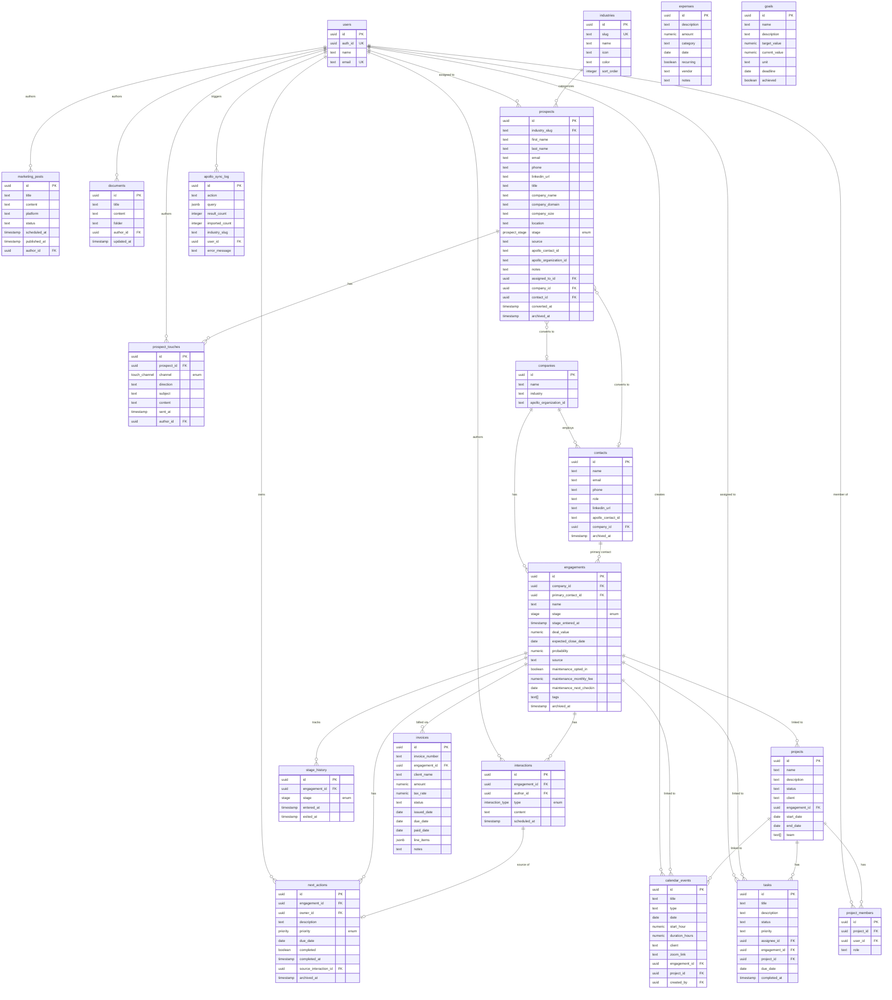

# Entity Relationship Diagram

```mermaid
erDiagram
    %% ── Enums ──────────────────────────────────────────────
    %% stage: lead | contacted | discovery | building_mvp | proposal | negotiation | build | deliver | maintain | closed_won | closed_lost
    %% priority: urgent | high | normal | low
    %% interaction_type: note | meeting | action | stage_change
    %% prospect_stage: cold | warm | hot | converted | lost
    %% touch_channel: email | linkedin | phone | referral | apollo

    %% ── Core CRM ───────────────────────────────────────────

    users ||--o{ interactions : "authors"
    users ||--o{ next_actions : "owns"
    users ||--o{ prospect_touches : "authors"
    users ||--o{ marketing_posts : "authors"
    users ||--o{ documents : "authors"
    users ||--o{ calendar_events : "creates"
    users ||--o{ tasks : "assigned to"
    users ||--o{ project_members : "member of"
    users ||--o{ prospects : "assigned to"
    users ||--o{ apollo_sync_log : "triggers"

    companies ||--o{ contacts : "employs"
    companies ||--o{ engagements : "has"

    contacts ||--o{ engagements : "primary contact"

    engagements ||--o{ interactions : "has"
    engagements ||--o{ next_actions : "has"
    engagements ||--o{ stage_history : "tracks"
    engagements ||--o{ projects : "linked to"
    engagements ||--o{ calendar_events : "linked to"
    engagements ||--o{ tasks : "linked to"
    engagements ||--o{ invoices : "billed via"

    interactions ||--o| next_actions : "source of"

    %% ── Outreach ───────────────────────────────────────────

    industries ||--o{ prospects : "categorizes"

    prospects ||--o{ prospect_touches : "has"
    prospects }o--o| companies : "converts to"
    prospects }o--o| contacts : "converts to"

    %% ── Delivery ───────────────────────────────────────────

    projects ||--o{ project_members : "has"
    projects ||--o{ tasks : "has"
    projects ||--o{ calendar_events : "linked to"

    %% ── Finance (standalone) ───────────────────────────────
    %% expenses, goals — no FK relationships

    %% ── Tables ─────────────────────────────────────────────

    users {
        uuid id PK
        uuid auth_id UK
        text name
        text email UK
    }

    companies {
        uuid id PK
        text name
        text industry
        text apollo_organization_id
    }

    contacts {
        uuid id PK
        text name
        text email
        text phone
        text role
        text linkedin_url
        text apollo_contact_id
        uuid company_id FK
        timestamp archived_at
    }

    engagements {
        uuid id PK
        uuid company_id FK
        uuid primary_contact_id FK
        text name
        stage stage "enum"
        timestamp stage_entered_at
        numeric deal_value
        date expected_close_date
        numeric probability
        text source
        boolean maintenance_opted_in
        numeric maintenance_monthly_fee
        date maintenance_next_checkin
        text[] tags
        timestamp archived_at
    }

    stage_history {
        uuid id PK
        uuid engagement_id FK
        stage stage "enum"
        timestamp entered_at
        timestamp exited_at
    }

    interactions {
        uuid id PK
        uuid engagement_id FK
        uuid author_id FK
        interaction_type type "enum"
        text content
        timestamp scheduled_at
    }

    next_actions {
        uuid id PK
        uuid engagement_id FK
        uuid owner_id FK
        text description
        priority priority "enum"
        date due_date
        boolean completed
        timestamp completed_at
        uuid source_interaction_id FK
        timestamp archived_at
    }

    industries {
        uuid id PK
        text slug UK
        text name
        text icon
        text color
        integer sort_order
    }

    prospects {
        uuid id PK
        text industry_slug FK
        text first_name
        text last_name
        text email
        text phone
        text linkedin_url
        text title
        text company_name
        text company_domain
        text company_size
        text location
        prospect_stage stage "enum"
        text source
        text apollo_contact_id
        text apollo_organization_id
        text notes
        uuid assigned_to_id FK
        uuid company_id FK
        uuid contact_id FK
        timestamp converted_at
        timestamp archived_at
    }

    prospect_touches {
        uuid id PK
        uuid prospect_id FK
        touch_channel channel "enum"
        text direction
        text subject
        text content
        timestamp sent_at
        uuid author_id FK
    }

    apollo_sync_log {
        uuid id PK
        text action
        jsonb query
        integer result_count
        integer imported_count
        text industry_slug
        uuid user_id FK
        text error_message
    }

    projects {
        uuid id PK
        text name
        text description
        text status
        text client
        uuid engagement_id FK
        date start_date
        date end_date
        text[] team
    }

    project_members {
        uuid id PK
        uuid project_id FK
        uuid user_id FK
        text role
    }

    calendar_events {
        uuid id PK
        text title
        text type
        date date
        numeric start_hour
        numeric duration_hours
        text client
        text zoom_link
        uuid engagement_id FK
        uuid project_id FK
        uuid created_by FK
    }

    tasks {
        uuid id PK
        text title
        text description
        text status
        text priority
        uuid assignee_id FK
        uuid engagement_id FK
        uuid project_id FK
        date due_date
        timestamp completed_at
    }

    invoices {
        uuid id PK
        text invoice_number
        uuid engagement_id FK
        text client_name
        numeric amount
        numeric tax_rate
        text status
        date issued_date
        date due_date
        date paid_date
        jsonb line_items
        text notes
    }

    expenses {
        uuid id PK
        text description
        numeric amount
        text category
        date date
        boolean recurring
        text vendor
        text notes
    }

    goals {
        uuid id PK
        text name
        text description
        numeric target_value
        numeric current_value
        text unit
        date deadline
        boolean achieved
    }

    marketing_posts {
        uuid id PK
        text title
        text content
        text platform
        text status
        timestamp scheduled_at
        timestamp published_at
        uuid author_id FK
    }

    documents {
        uuid id PK
        text title
        text content
        text folder
        uuid author_id FK
        timestamp updated_at
    }
```
